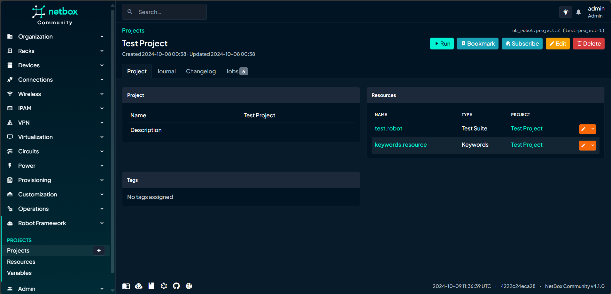
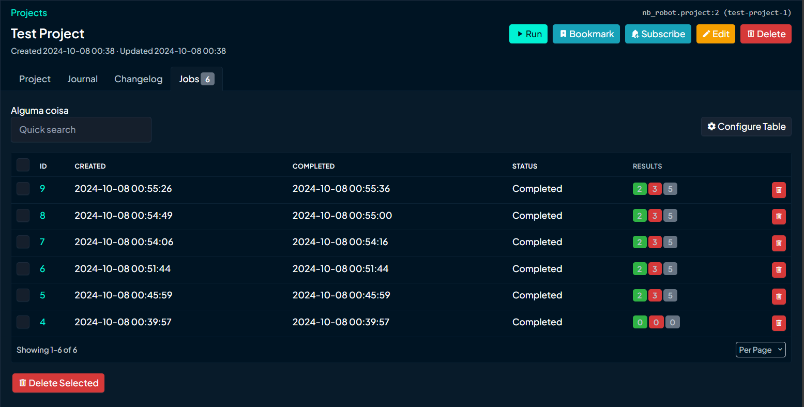
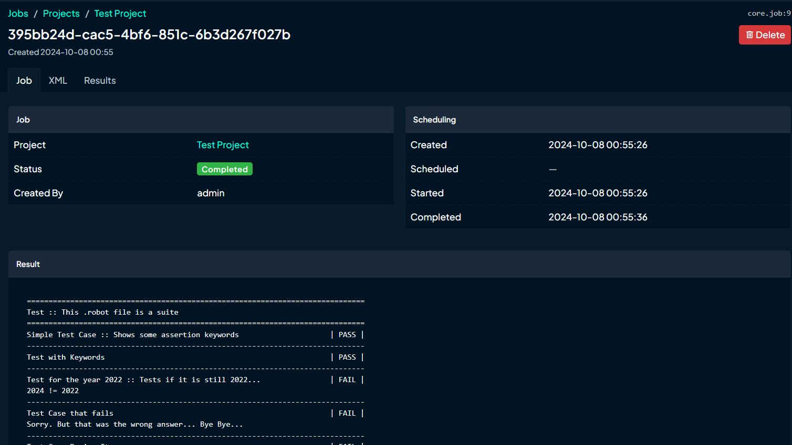
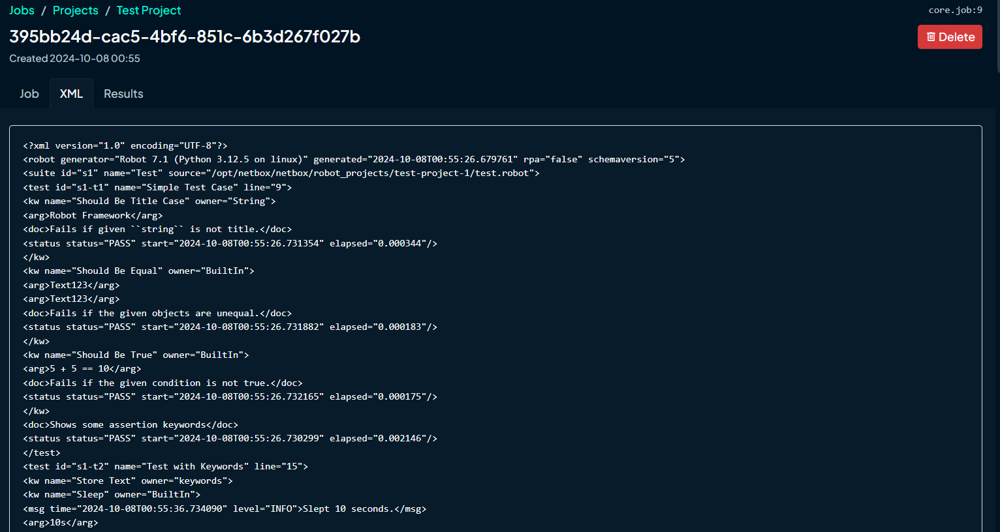
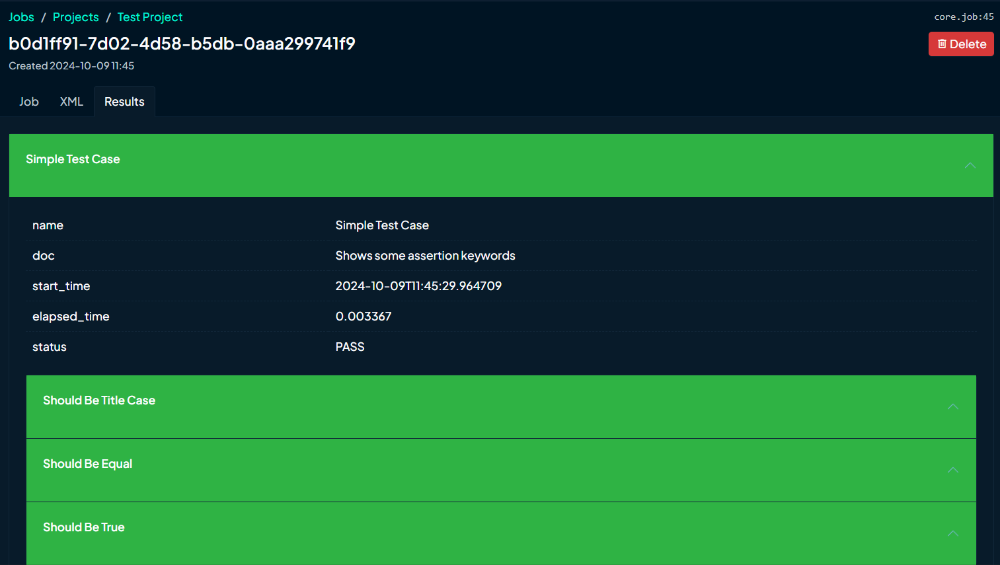
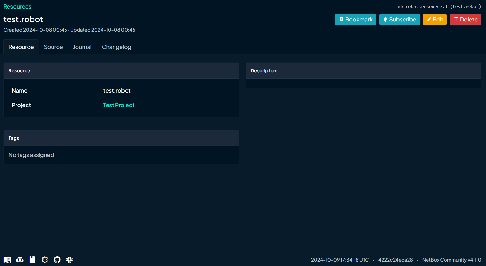
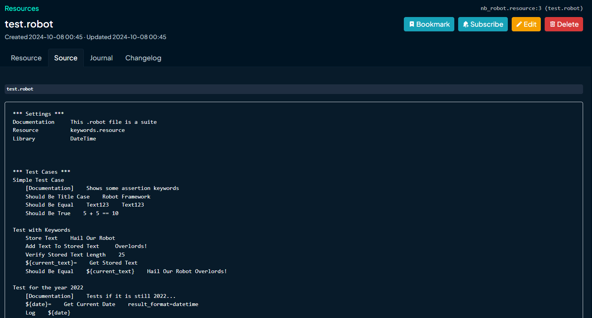
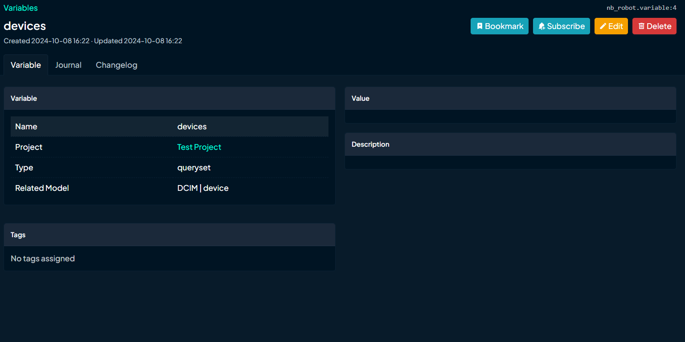

# Netbox nb-robot

The nb-robot plugin extends the capabilities of NetBox by seamlessly integrating Robot Framework, a widely used open-source test automation framework. Here’s what this plugin brings to the table:

1 - Test Automation Integration:
* With the nb-robot plugin, NetBox users gain the ability to load and execute their Robot Framework test suites directly from within the NetBox web interface. This integration streamlines the process of running tests against network devices, configurations, and other critical infrastructure managed in NetBox.
* Whether you’re validating network changes, checking connectivity, or ensuring proper configurations, the plugin empowers you to automate these tasks effortlessly.

2 - Model-Based Testing:
* Leveraging NetBox’s existing data models (such as devices, interfaces, circuits, and more), the nb-robot plugin creates a vital bridge between network documentation and test automation.
* Users can associate specific test cases or entire test suites with NetBox models. For example, you can link a Robot Framework test suite to a particular switch or router model within NetBox.
* This model-based approach simplifies validation: Want to verify that a new VLAN configuration is correctly applied across all relevant devices? Associate your test suite with the VLAN model, and let the plugin handle the rest.


## Compatibility

| Plugin Version | NetBox Version | Tested on                      |
| ------------- |:-------------| :-----:|
| 1.0.0          | > 4.1.0                | 4.1.0                          |


## Installation

The plugin is available as a Python package in pypi and can be installed with pip

```
pip install nb-robot
```
Enable the plugin in /opt/netbox/netbox/netbox/configuration.py:
```
PLUGINS = ['nb_robot']
```
Create a project folder and give netbox user read and write permissions over it
```
$ sudo mkdir /opt/netbox/netbox/robot_projects
$ sudo chown --recursive netbox /opt/netbox/netbox/robot_projects
```


## Configuration

```python
PLUGINS_CONFIG = {
    "nb_robot": {
        "projects_path": <custom_path>  ##  Path for storing Robot Framework project files
    },
}
```

## Using Variables

With NBRobot you can inject variables inside your `Test Suite` in two ways, as a simple variable or in a Data Driven stile with `Test Template`

### Simple Variable

After creating the variable `devices` inside NBRobot plugin you can callit inside your `Test Suite` like above:

```
*** Test Cases ***
Test Case Device Iter
    FOR     ${device}       IN      @{devices}
        Log     ${device.site}
    END
```

### DataDriven model

In the DataDriven model NBRobot creates a `Test Case` based in the `Test Template` for each model inside your variable

```
*** Settings ***
Test Template    Check Naming Conventions

*** Test Cases ***

Check ${device} Naming Conventions

*** Keywords ***
Check Naming Conventions
    [Arguments]    ${device}
    Log Many    ${device}    ${device.site}
```

## Roadmap

* Allow users to setup variable values before running a Project
* Allow users to compare two Project Jobs
* Create API endpoint to Run and gather Suite results
* Create Unit Tests

## Screenshots

### Project Views



### Project Jobs



### Result View



### Result XML



### Result Table



### Resource View



### Resource Source



### Variable View


